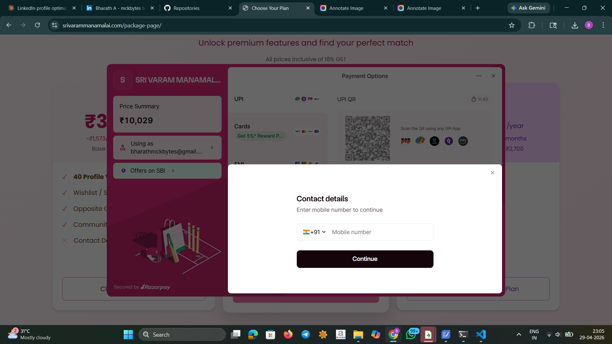

# 💍 Matrimony Web Application

A modern matrimonial web application designed to help individuals find compatible life partners with ease. This platform provides a secure, user-friendly interface for profile creation, browsing, and communication.

🌐 **Live Website:** https://srivarammanamalai.com/

---

## 📌 Features

* 🏠 Home page with user-friendly navigation
* 👤 User profile creation and management
* 🔍 Search and filter profiles
* 💌 Matchmaking functionality
* 💳 Secure payment integration
* 🔐 Authentication & authorization system
* 📱 Responsive design for mobile and desktop

---

## 🛠️ Tech Stack

**Frontend:**

* HTML5
* CSS3
* Bootstrap
* JavaScript

**Backend:**

* Python
* Django Framework

**Database:**

* SQL (SQLite / MySQL)

**API:**

* REST API for data handling and integration

---

## 📂 Project Structure

## 📂 Project Structure

```
APPSOURCE/
│── config/                # Project settings and configuration
│── crispy_bootstrap5/     # Bootstrap 5 integration (Django Crispy Forms)
│── crispy_forms/          # Form rendering utilities
│── fixture/               # Initial data / fixtures
│── img/                   # Project screenshots (home, profile, payment)
│── logs/                  # Application logs
│
│── mck_admin_console/     # Admin panel app
│── mck_auth/              # Authentication (login/register)
│── mck_master/            # Core/master data management
│── mck_website/           # Main website functionality
│
│── media/                 # User uploaded files
│── static/                # CSS, JS, images
│── scripts/               # Utility scripts
│
│── venv/                  # Virtual environment (not for production)
│── manage.py              # Django project manager
│── mck.sqlite3            # Database (SQLite)
│
│── requirements.txt       # Python dependencies
│── runtime.txt            # Runtime version (for deployment)
│── run.txt                # Run instructions
│── PAYMENTGATWAY          # Payment integration config
│── PACKAGE.CODE           # Project-specific config/code
│
│── README.md              # Project documentation
```

<<<<<<< HEAD
## 📸 Screenshots

### 🏠 Home Page


### 👤 Profile Page


### 💳 Payment Page

---
=======
>>>>>>> fb8d7fb (code base)

## 📸 Screenshots

### 🏠 Home Page


### 👤 Profile Page


### 💳 Payment Page


---

## 🚀 Installation & Setup

1. Clone the repository:

```bash
git clone https://github.com/your-username/matrimony-site.git
cd matrimony-site
```

2. Create a virtual environment:

```bash
python -m venv env
source env/bin/activate   # On Windows: env\Scripts\activate
```

3. Install dependencies:

```bash
pip install -r requirements.txt
```

4. Apply migrations:

```bash
python manage.py migrate
```

5. Run the server:

```bash
python manage.py runserver
```

6. Open in browser:

```
http://127.0.0.1:8000/
```

---

## 🔐 Authentication

* User registration and login system
* Secure password handling
* Profile privacy controls

---

## 💳 Payment Integration

* Integrated payment module for premium features
* Secure transaction handling

---

## 📡 API Integration

* REST APIs used for:

  * User data management
  * Profile matching
  * Payment processing

---

## 🎯 Purpose

This project is designed to simplify the matchmaking process by providing a digital platform where users can create profiles, search for partners, and communicate securely.

---

## 🔐 Security Notice

For security reasons, some sensitive configurations have been removed from this repository:

* `settings.py` (secret keys, database credentials)
* Media files (user-uploaded content)
* Environment-specific configurations

### ⚙️ Setup Instructions

To run this project locally, you need to create your own configuration:

1. Create a `.env` file in the root directory:

```env
DEBUG=True
SECRET_KEY=your_secret_key
DATABASE_URL=your_database_url
ALLOWED_HOSTS=127.0.0.1,localhost
```

2. Recreate `settings.py` or update it to use environment variables:

```python
import os

SECRET_KEY = os.getenv("SECRET_KEY")
DEBUG = os.getenv("DEBUG") == "True"
```

3. Create required folders:

```bash
mkdir media
mkdir logs
```

4. Apply migrations and run the server:

```bash
python manage.py migrate
python manage.py runserver
```

---

## 🔒 Best Practices

* Never expose your `SECRET_KEY`
* Do not upload database files (`.sqlite3`)
* Use environment variables for sensitive data
* Keep `DEBUG = False` in production


## 📄 License

This project is licensed under the MIT License.

---

⭐ Feel free to contribute and improve this project!
